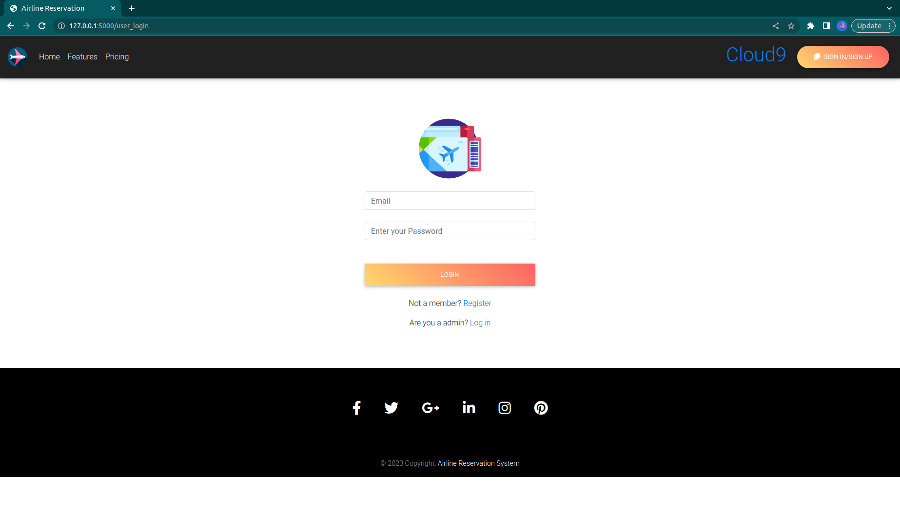
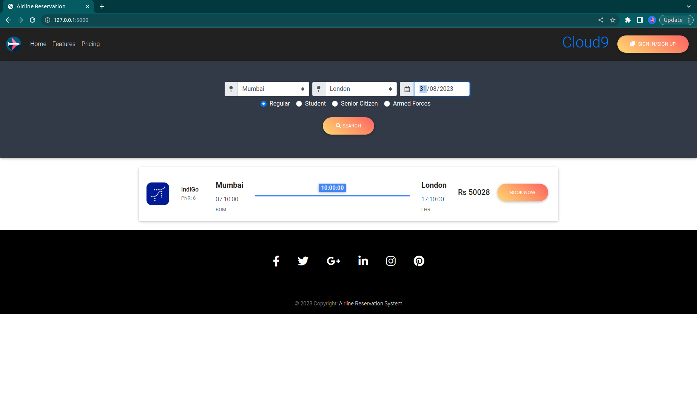
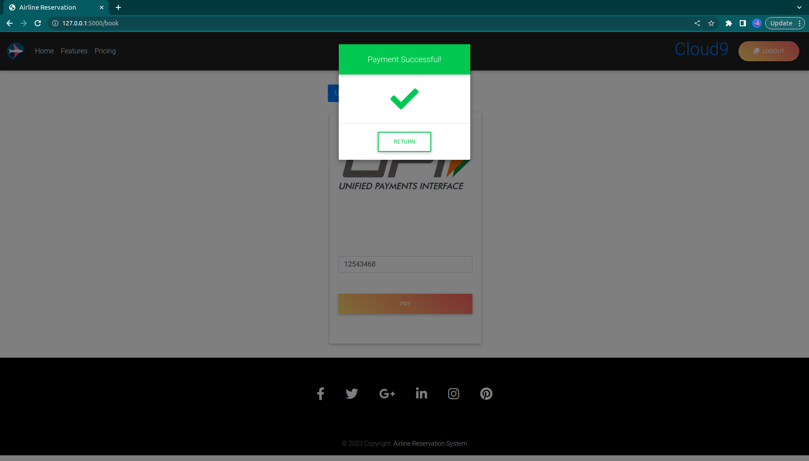

# Airline-Reservation-System

This web application allows users to search for flights, make bookings, and manage reservation. The repository streamlines the flight booking process by providing a user-friendly interface for travelers.

## Features

- User Registration and Login system.
- Search for flights based on source, destination, and departure date.
- Book flights for various passenger types: regular, student, senior citizen, and armed forces.
- Admin panel for managing flights, routes and schedules.

## Technologies Used

- Python Flask
- PostgreSQL
- SQLAlchemy
- HTML5/CSS3
- Bootstrap

## Screenshots

### Home Page


### Search Page



### Payment Page


## Getting Started

1. Clone the repository:
    ```
   git clone https://github.com/mn1k/Airline-Reservation-System
   ```

2. Navigate to the project directory:
   ```
   cd Airline-Reservation-System
   ```

3. Database Setup:
   - Set up a PostgreSQL database.
   - Execute the SQL commands provided in the `sql` directory to create the required tables and procedures.

4. Configure Database Credentials:
   - In `main.py`, update the database connection details with your PostgreSQL credentials.

5. Run the application:
   ```
   python main.py
   ```

6. Access the application:
   - Open your web browser and visit
     ```
     http://localhost:5000/
     ```

## Usage

- Register as a user or login if you already have an account.
- Search for flights, make bookings, and manage reservations.
